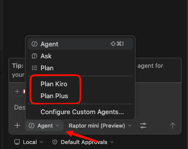

# VS Code Copilot Agents

A collection of AI Agent configurations for VS Code Copilot Chat designed to enforce a structured, spec-driven development workflow: **Plan → Design → Execute**. 

This helps prevent Copilot from jumping straight into code by forcing it to gather requirements, build a design, and break work down into a granular checkbox list before a single line of code is written.

---

## 🤖 The Agents

This repository includes several agent templates you can install directly into VS Code:

### 1. Plan Plus (`@plan-plus`)
An all-in-one planning agent. It gathers requirements to create `spec.md`, drafts `design.md`, and creates a checkbox-driven `tasks.md`. It keeps you in the loop for approval at each phase.

### 2. Plan Kiro (`@plan-kiro`)
A strict, spec-driven planning agent that produces Kiro-style documents: `requirements.md` (using EARS notation), `design.md`, and `tasks.md`. It incorporates robust formal requirements processing with sub-agents for exploration.

### 3. Execute Kiro (`@execute-kiro`)
The coding agent. Once your tasks are generated, this agent meticulously reads the `tasks.md`, strictly implements each step (marking them `[~]` and `[x]`), and asks for confirmation between major phases.

---

## 🛠️ Installation

This repository includes OS-aware installers to automatically copy the agents to your VS Code Copilot Agents directory (`~/.copilot/agents`).

### macOS / Linux
```bash
curl -fsSL https://raw.githubusercontent.com/firmantr3/copilot-agent/main/install.sh | bash
```
*(Or clone the repo locally and run `bash ./install.sh`)*

### Windows (PowerShell 7+)
```powershell
pwsh -NoProfile -ExecutionPolicy Bypass -Command "iwr 'https://raw.githubusercontent.com/firmantr3/copilot-agent/main/install.ps1' | iex"
```

### Windows (PowerShell 5.1 Classic)
```powershell
powershell -NoProfile -ExecutionPolicy Bypass -Command "iwr 'https://raw.githubusercontent.com/firmantr3/copilot-agent/main/install.ps1' -UseBasicParsing | iex"
```

---

## 🚀 How to Use (VS Code Copilot Chat)

1. Open **Copilot Chat** in VS Code.
2. Start a new chat for your feature.
3. @-mention your preferred planning agent (`@plan-plus` or `@plan-kiro`) and describe what you want to build.
   - Example: `@plan-kiro Add a new dark mode toggle to the navbar`
4. The agent will formulate questions, gather context, and draft the Spec, Design, and Tasks. Review and approve the documents.
5. Once `tasks.md` is complete, use the **🚀 Start Tasks** handoff button to begin implementation.
   - This button automatically delegates execution to the `@execute-kiro` agent. 
   - `@execute-kiro` is configured by default to use rapid, cost-efficient models (like Raptor mini or GPT-4.1), allowing it to immediately power through the generated task list at high speed.
   - Alternatively, you can explicitly @-mention `@execute-kiro` in a new chat.



---

## ⚙️ Customizing the Agents

The agents are designed to be customizable without requiring you to edit the `.agent.md` files directly (which would be overwritten if you re-run the install script).

### Global Custom Rules (The Hook)
All agents check for a `~/.kiro/user-rules.md` file globally. If it exists, they will read it automatically.

1. Create `~/.kiro/user-rules.md` anywhere on your machine.
2. Add your global constraints (e.g., "Always use TypeScript", "Prefer functional React components", "Never use Tailwind").
3. The agents will automatically apply these rules to every project they work on.

### Project-Specific Rules
For `@plan-kiro` and `@plan-plus`, you can add constraints to a `.kiro/steering/` directory inside your specific project. They will read any Markdown files in this directory to inform design and architectural decisions.

> The agents auto-detect your project's language and tech stack. TypeScript is the most battle-tested, but the templates are designed to work with any language. Use `~/.kiro/user-rules.md` to add language-specific constraints if needed.

---

## 📝 License

Add a license (MIT/Apache-2.0/etc.) if you plan to share this publicly.
